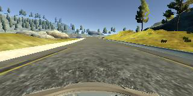

# Self-Driving Car Engineer Nanodegree
# Deep Learning
## Behavioral Cloning: Navigating a Car in a Simulator

### Overview

The objective of this project is to clone human driving behavior using a Deep Neural Network. In order to achieve this, we are going to use a simple Car Simulator. During the training phase, we navigate our car inside the simulator using the keyboard. While we navigating the car the simulator records training images and respective steering angles. Then we use those recorded data to train our neural network. Trained model was tested on two tracks, namely training track and validation track. Following two animations show the performance of our final model in both training and validation tracks.

Training | Validation
------------|---------------
 | 

### Dependencies

This project requires **Python 3.5** and the following Python libraries installed:

- [Keras](https://keras.io/)
- [NumPy](http://www.numpy.org/)
- [SciPy](https://www.scipy.org/)
- [scikit-learn](http://scikit-learn.org/)
- [TensorFlow](http://tensorflow.org)
- [Pandas](http://pandas.pydata.org/)
- [Matplotlib](http://matplotlib.org/)
- [Jupyter](http://jupyter.org/) (Optional)

Run this command at the terminal prompt to install [OpenCV](http://opencv.org/). Useful for image processing:

- `conda install -c https://conda.anaconda.org/menpo opencv3`

### How to Run the Model

This repository comes with trained model which you can directly test using the following command.

- `python drive.py model.json`

## Implementation

### Data Capturing

During the training, the simulator captures data with a frequency of 10hz. Also, at a given time step it recorded three images taken from left, center, and right cameras. The following figure shows an example I have collected during the training time.

Left| Center | Right
----|--------|-------
 |  | 

Collected data are processed before feeding into the deep neural network and those preprocessing steps are described in the latter part of this file. 

### Archi

 

 

