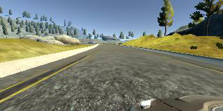
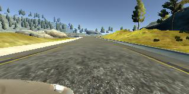

# Self-Driving Car Engineer Nanodegree
# Deep Learning
## Behavioral Cloning: Navigating a Car in a Simulator

### Overview

The objective of this project is to clone human driving behavior using a Deep Neural Network. In order to achieve this, we are going to use a simple Car Simulator. During the training phase, we navigate our car inside the simulator using the keyboard. While we navigating the car the simulator records training images and respective steering angles. Then we use those recorded data to train our neural network. Trained model was tested on two tracks, namely training track and validation track. Following two animations show the performance of our final model in both training and validation tracks.

Training | Validation
------------|---------------
 | 

### Dependencies

This project requires **Python 3.5** and the following Python libraries installed:

- [Keras](https://keras.io/)
- [NumPy](http://www.numpy.org/)
- [SciPy](https://www.scipy.org/)
- [TensorFlow](http://tensorflow.org)
- [Pandas](http://pandas.pydata.org/)
- [OpenCV](http://opencv.org/)
- [Matplotlib](http://matplotlib.org/) (Optional)
- [Jupyter](http://jupyter.org/) (Optional)

Run this command at the terminal prompt to install [OpenCV](http://opencv.org/). Useful for image processing:

- `conda install -c https://conda.anaconda.org/menpo opencv3`

### How to Run the Model

This repository comes with trained model which you can directly test using the following command.

- `python drive.py model.json`

## Implementation

### Data Capturing

During the training, the simulator captures data with a frequency of 10hz. Also, at a given time step it recorded three images taken from left, center, and right cameras. The following figure shows an example I have collected during the training time.

Left| Center | Right
----|--------|-------
 |  | 

Collected data are processed before feeding into the deep neural network and those preprocessing steps are described in the latter part of this file. 

### Dataset Statistics
The dataset consists of 24108 images ( 8036 images per camera angle). The training track contains a lot of shallow turns and straight road segments. Hence, the majority of the recorded steering angles are zeros. Therefore, preprocessing images and respective steering angles are necessary in order to generalize the training model for unseen tracks such as our validation track.

Next, we are going explain our data processing pipeline.

### Data Processing Pipeline
The following figure shows our data preprocessing pipeline.

 

In the very first state of the pipeline, we apply random shear operation. However, we select images with 0.9 probability for the random shearing process. We kept 10 percent of original images and steering angles in order to help the car to navigate in the training track.

The images captured by the simulator come with a lot of details which do not directly help model building process.  In addition to that extra space occupied by these details required additional processing power. Hence, we remove 35 percent of the original image from the top and 10 percent. This process was done in crop stage.

The next stage of the data processing pipeline is called random flip stage. In this stage we randomly (with 0.5 probability) flip images. The idea behind this operation is left turning bends are more prevalent than right bends in the training track. Hence, in order to increase the generalization of our mode, we flip images and respective steering angles. 

### Archi

 

